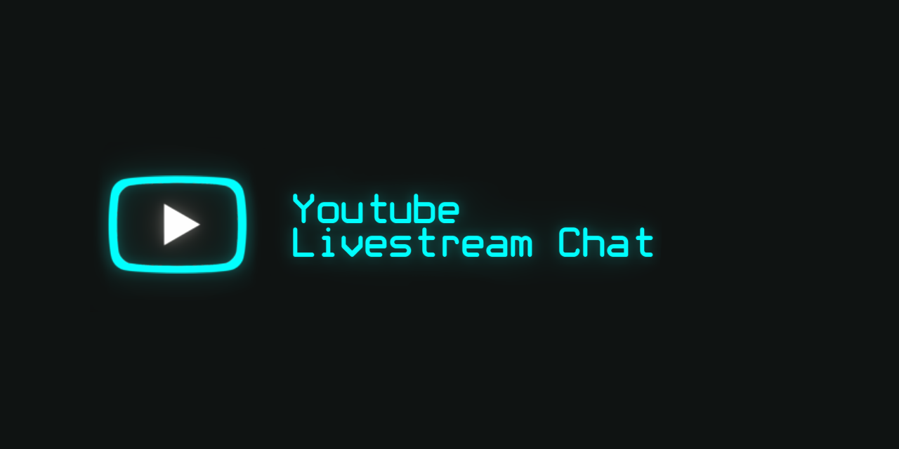

# Youtube Livestream Chat

Unity and C# implementation of displaying a Youtube livestream chat, as well as additional features that can help with filtering or interactivity. Done with [Youtube Data API V3](https://developers.google.com/youtube/v3/), this can be used as an alternative Youtube chat displayer with a Google API Key and a video ID of the current livestream. Future iterations will give additional functionality that's currently lacking on Youtube.

For an idea on what could be done with this system, [I currently have an interactive game running every day on a separate Youtube channel](https://www.youtube.com/channel/UCRcljlI4ACjc5VWZVr4WdnA) that is yet to find any players.

***

## Features
- Chat display - A regular chat display for a given video ID. One advantage this has over a direct chat window from Youtube is being able to (for most of the time) display messages with lower latency, as long as the request delay is equal or below the Youtube recommended polling wait time.
- Focus mode - A nearly identical chat display that can be used to filter in specific users. Current features are to filter in moderators, members, or any user by their specific username, adding them one by one and making a "focused" chat display.
- Voter - A "regular" voting system that resembles Youtube voting. Has the ability to manually write a question and a set of answers with prompts. Prompts are what users within a chat have to write to have their vote registered.. If left empty, numbers will be automatically generated as votable choices. Up to 10 answers can be tracked. An optional choice to be able to change your vote is also available.
- Poller - A freeform voting system. Instead of giving a choice, it keeps track of what users are generally writing and shows the 10 most written things. Also, if a user has written something new, their old message and its count is removed. Messages are also automatically removed after 20 queries to keep information fresh. Good for situations where you want to quickly see what choices the chat would make.

## Installation
[Download the Version 2 build here](https://github.com/stat-void/Youtube-Livestream-Chat/releases/download/V2/Youtube-Livestream-Chat-V2.zip), unpack it and run the executable.

## Usage

#### API Key (Instructions also in the application)
1. Log in to https://console.cloud.google.com using your Google/Youtube account.
2. Create a new project and give it any name you want. If you can't find it -> https://console.cloud.google.com/projectcreate
3. From Navigation, go to "APIs & Services -> Library" and add "youtube data api v3" to your project. If you can't find it -> https://console.cloud.google.com/apis/library/youtube.googleapis.com
4. From Navigation, go to "APIs & Services -> Credentials" and create new credentials (API key). If you can't find it -> https://console.cloud.google.com/apis/credentials
5. (Optional) On the same credentials page, add restrictions to only use Youtube Data API for the API key.

#### Video ID
https://www.youtube.com/watch?v={VIDEO_ID}. Copy the "VIDEO_ID" area from the actual livestream and paste it in the application.

#### Limitations
1. By default, each API key has access to 10,000 quota points per day. Getting the chat ID of a livestream costs one point and every chat message request costs five points, or about 2000 requests per day.

With a 3 second delay, this is about 100 minutes of real-time use, with 5 seconds, 166 minutes. 

Unless you want to use the chat display, you should generally pause requests whenever they are not required to preserve quota usage. Otherwise, you can manually adjust request delay in the settings if you want to keep a feature running for a long time.

For more information on quotas and requesting increases to the quota cap (might come with additional costs) -> https://cloud.google.com/docs/quota

2. Quota limits are reset every day at midnight PST (GMT -8). This application can't see how many points have actually been used, but if you have saved your API key in this application, it keeps track of local usage, which is reset whenever passing the reset point.

3. If the request delay is too large (unsure of exact value), then message retreival is automatically limited to the newest 75 messages.

4. If you want to display parts of this application directly through a stream, please be aware that viewers will see it at a delay:

* Ultra-Low latency -> 2.5 to 5 seconds
* Low latency -> 5 to 15 seconds

## Project Status (Roadmap)
I've changed my mind regarding the other project, for now. I'll finish V3, then make a video about my findings.

- Personalisation view - To give a little bit of freedom in the program appearance, such as disabling bloom, or changing the display colors.
- Keyword listener view - An alternate Focus Mode where it tries to capture specific keywords instead. Optionally, has options to capture superchats, or membership related events.
- Submenus for the general tab picker - So that all of these ideas can be better grouped? For example, a general option for "chat", that opens a submenu to pick between 3 actual choices - the regular chat, focus mode, or the new keyword listener view?
- Voter updates - Give options for voting to be less strict (the prompt is written somewhere in text), and make an optional addition that allows only people who voted in a specific way to participate in the next vote.
- OAuth version integration, if I can figure it out. Then this can be used on membership streams. However, I have to find a way that doesn’t involve saving your username/password, because that breaks TOS.
- Data conversion to JSON has been made, but there was a peculiar timer bug that I want to investigate a bit. For some reason, Using a custom timer that does send event notifications upon passing, causes UnityWebRequest to stop working?
- Backlog - CRT video afterglow effect creation - In regards to a future project that I'll look into. I want to test out making a post-processing effect (or a simple quick solution) for that CRT monitor effect when viewed through a camera with different refresh rates. In here, it would be a part of the personalisation view.
- Backlog - More text support, as usual.

## Support
- Youtube Channel - [Stat Void](https://www.youtube.com/channel/UCRcljlI4ACjc5VWZVr4WdnA). Showing interest in the stuff I'm doing is probably the best way to support right now.

## License
This project is licensed under the terms of the MIT license.

